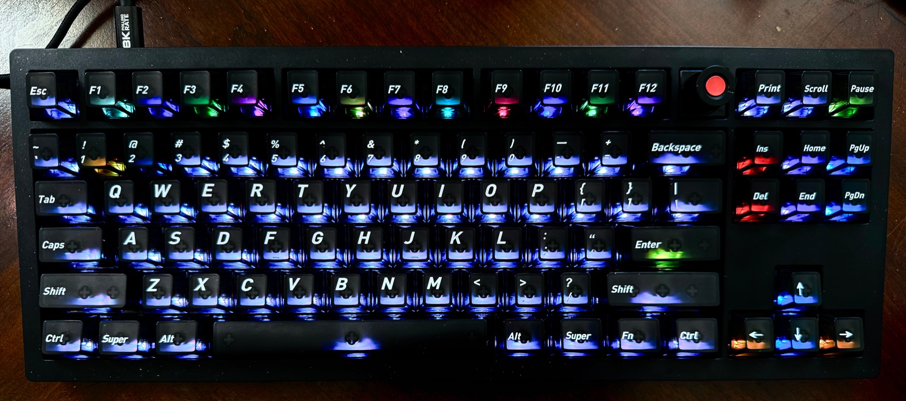
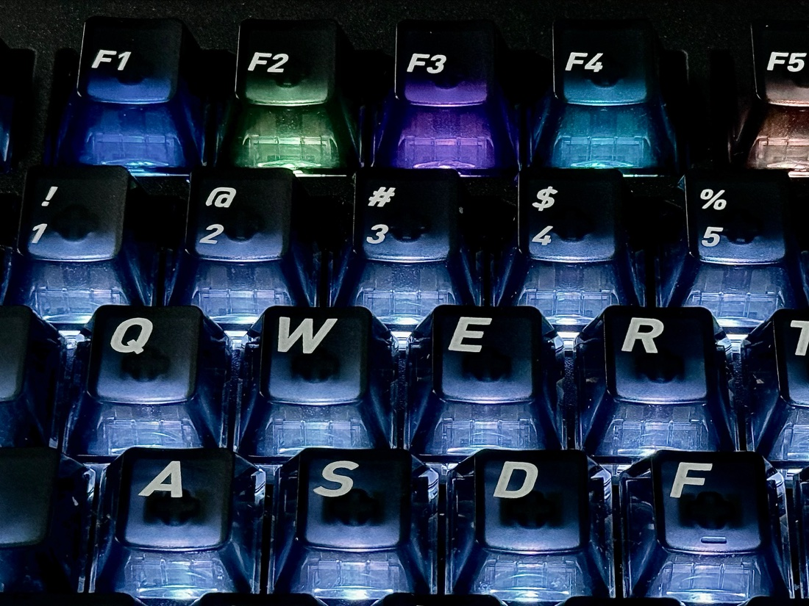
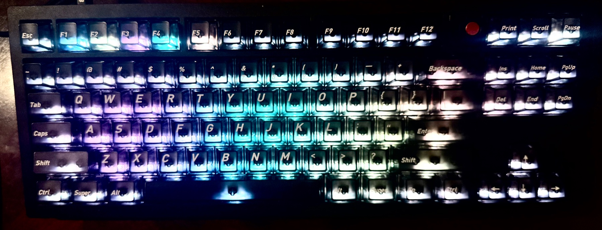

<p align="center">
  
</p>

# Abralia

## Give Your Keyboard an Agent Mode - Without Tradeoff

***Don't be afraid of flashing our firmware! Your V3 8K keeps its existing RGB
modes, VIA and Keychron Launcher configuration, and the 8K polling option—plus
new agent controls and cool lighting effects!***

**Your agents can call you through your keyboard. Pick up a task with a key,
mute interruptions, and see pending calls as floating lights.**

<p align="center"></p>

*Different agents. Different colors. Pick one with a key.*

Abralia is an open-source firmware and desktop software project that turns a
compatible per-key RGB keyboard into a physical interface for coding agents.
Agents occupy colored slots, request attention through the keyboard, and let
you pick up a task, mute interruptions, or browse tasks using physical controls.

**Current application: a Codex keyboard interface on macOS.** The repository
includes a Python backend, Codex plugin, automatic session observation and
keyboard interaction. The
[macOS control panel](abralia/desktop/gui/README.md) scans supported keyboards,
remembers your choice, starts one shared backend and lets you enable or mute
projects. **Connect Codex** installs the bundled skill, MCP tools and named hooks;
Codex's hook-trust review remains a separate user step.

Abralia is compatibility-first and additive by design. Its native firmware
keeps Keychron RGB effects 0–24 and keeps VIA/Keychron Launcher, encoder, and
8K report-rate support enabled while adding independent per-key brightness,
effect 25, and an opt-in Host Interaction Mode.

It does not require permanently replacing ordinary keys with unused F13–F24
bindings. Unbound controls continue to behave normally, Host Interaction
bindings are volatile, and stale or disconnected host sessions are designed
to restore ordinary input behavior.

The firmware and standalone desktop RGB/input APIs can also be used independently
of the agent backend.

## Task colors and notifications

### One color per task

Each registered task gets an identity color and a stable logical slot. F1–F12
show one page of twelve slots; the same task keeps its color as it works,
requests attention, or moves to another position. The color identifies the
task, while animation and highlighting indicate attention and selection.

<details open>
<summary><strong>See the task slots up close</strong></summary>

<p align="center"></p>

*The colored F-slots identify separate tasks. Preview a task with the navigation
keys or optional knob, then press Enter to open it; an occupied F-key opens it
directly.*

</details>

### When several agents need your attention

A new call starts with a yellow-green arrival animation, then transitions and
breathes in the calling task's color. If it remains unpicked, the broad color
contracts into a floating fog orb. Each task contributes one orb, so several
pending callers share the keyboard surface in their own colors.

<p align="center"></p>

*Five agents' pending notifications sharing the keyboard surface. Each fog orb
belongs to a task; overlapping orbs blend their colors.*

The soft fog envelopes overlap while smaller collision cores deflect one
another. Saturated centers keep task colors recognizable. Fog can drift through
the typing, navigation and arrow regions; active control highlights remain
visible above it. Arrival animations are queued independently of pending calls,
so one unanswered task does not block the next task's visual introduction.

Pick up a task with Print Screen, its F-key, or an Enter-confirmed preview to
remove its existing orb. A later notification can create a new reminder;
retries do not duplicate or restart an existing one. Scroll Lock mutes the
current call's strong announcement and leaves a quiet orb. Ten-minute agent
mutes hide affected orbs while their age continues.

By default, an orb holds for two minutes and fades over the next minute, within
its notification's lifetime. Fading only clears the visual reminder; it does
not answer a question or mark the task viewed. Direct clicks inside Codex are
not currently tracked as exact-task viewing events. See the
[notification fog guide](abralia/desktop/BACKEND.md#notification-fog) for timing
settings, simulation, image previews and the bounded hardware demo.

## What works today

- **One terminal backend owns the keyboard.** A serialized device worker handles
  RGB and input through `SharedRawHidSession`; MCP bridges use a private local
  socket and never open HID themselves. Hardware and simulated modes are available.
- **Agents register through project-local MCP.** They can report progress and
  request attention. The host can also register existing project tasks without
  waking them, release individual slots, or release all slots.
- **Stable task identity with movable placement.** Each allocation has a slot ID,
  ownership token and identity color. Its displayed page/F-key is a separate
  mapping, so rearranging the keyboard does not assign an agent another task's slot.
- **Notifications and conversation pickup.** Incoming calls appear without first
  selecting an agent. Pickup opens its registered Codex task; mute quiets the call.
  The Codex observer can detect pending native questions and their replies.
- **Paged navigation and attention controls.** Twelve positions per page, optional
  knob browsing, direct page jumps, selected-slot brightness breathing, ten-minute
  individual mutes and an “only this agent” mode are implemented. Page indicators
  appear briefly after a page change and remain available in knob selection mode.
- **Manual gap closing.** Hold an empty F-key in active Agent Mode: the whole gap
  brightens and flashes, then later agents compact forward across pages while
  retaining their identities and state.
- **Bounded cleanup and recovery.** Backend shutdown releases volatile bindings
  and attempts to restore the saved RGB scene. A surviving verified MCP bridge
  can restore allocations and identity colors after a backend restart with fresh
  tokens. Calls, questions and orbs are not restored; host-only registrations
  must be repopulated.

The Codex notification/pickup workflow and selected navigation/lighting behaviors
have been exercised on reference hardware, including whole-gap closing and
selected-slot brightness breathing. A five-task live MCP trial confirmed the
multi-agent fog display, stronger center colors and orb removal after pickup.
Automated checks cover ownership, retries, paging, input routing, rendering,
collision and color-mixing math, independent notification lifetimes, recovery,
project setup and real STDIO MCP clients.

Agents use semantic operations: `acquire_slot`, `release_slot`, `set_slot_state`,
`set_notification`, `report_question`, `clear_question`, and `get_status`.
Optional `set_notification_animation` adds a short effect over the task color;
agents without an immediate idea simply keep the default. `show_keyboard_frame`
can explain a keymap after pickup, with Escape to close it and
`clear_keyboard_frame` for explicit withdrawal. Highlighting does not remap keys.
The backend owns animation, input bindings and policy. See the
[agent tool contract](abralia/desktop/BACKEND.md#agent-tools) for ownership and
retry rules; agents do not receive raw HID or native approval execution.

**Optional extensions:** native question-panel focus and keyboard execution of
answers/approvals are not required for the notification, navigation and attention
workflow. They are not currently implemented; answer questions in Codex's native
UI. Broader GUI settings, launch at login and other harness
adapters are separate future enhancements. The numbered keys used for page
navigation are not answer shortcuts.
Codex session observation currently depends
on local client data formats and needs compatibility checks when the client changes.

## Try the backend

For the packaged macOS workflow, open Abralia, choose your keyboard, use
**Integrations → Connect Codex**, review its hooks in Codex, then add your project
folders. See the [app setup guide](abralia/desktop/gui/README.md) and the
[standalone plugin bundle](abralia/desktop/plugin-bundle/README.md).

The separate terminal workflow remains available for development:

From the repository root, using Python 3.11+:

```sh
python3 -m venv .venv
.venv/bin/python -m pip install -e 'abralia/desktop[backend]'
.venv/bin/abralia-backend enable-project --project /path/to/project
.venv/bin/abralia-backend serve --project /path/to/project \
  --profile builtin:keychron-v3-8k-ansi-encoder-effect25 --mode simulated
```

Use the same existing project path in each command. Enablement installs only
Abralia's project-local MCP configuration and skill; Codex must trust the project
and load its MCP tools. Simulated mode does not access the keyboard or open tasks.

For a physical keyboard, install the matching
[Host Interaction firmware](abralia/firmware/qmk-userspace/README.md), select RGB
effect 25, and start the backend with `--mode hardware`. The backend does not
flash firmware. See the [backend guide](abralia/desktop/BACKEND.md) for setup,
host registration/release commands, appearance settings, recovery and limitations.

## Reference keyboard controls

These labels refer to physical positions on the V3 8K profile, independently of
their VIA keycode mappings. Task controls operate while Agent Mode is active.

| Gesture | Action |
| --- | --- |
| Double-tap Pause | Enter or leave Agent Mode |
| Occupied F-key | Select and open that task; a pending call is picked up |
| Green Print Screen / red Scroll Lock | Pick up / mute the incoming call |
| Hold Pause | Toggle the temporary navigation-key layer |
| Page Up / Up, Page Down / Down in keyboard navigation | Previous / next page |
| Left / Right in keyboard navigation | Preview the previous / next occupied slot on the page |
| Home / End in keyboard navigation | Preview the first / last task across all pages |
| Enter with a task preview | Select and open that task |
| Knob press, when available | Switch between agent and page browsing; Enter confirms a preview |
| Number-row keys in agent-selection mode | Jump to occupied pages |
| Delete / Insert in keyboard navigation | Toggle an individual ten-minute mute / “only this agent” |
| Hold Delete in keyboard navigation | Clear individual mutes |
| Hold an empty F-key | Close that gap across later pages |
| Escape while focused | Leave task focus and restore the background |

The [backend guide](abralia/desktop/BACKEND.md#physical-interaction) describes
the complete key mapping, timers and lighting codes. Inactive typing retains
ordinary input. The backend preserves the keyboard's own brightness limit.

Navigation keys disarm after 15 seconds without navigation activity; knob
agent-selection mode returns to page browsing after 60 seconds without selection
activity. Selected-task background color and Escape's cue hold for 15 seconds,
then fade together over five seconds. That lighting fade does not end task focus
or answer a pending question. These timers and the idle white background are
host settings, separate from the keyboard's brightness ceiling.

Muted slots become dimmer and less saturated. Delete and Insert act on the
previewed task first, then the focused task, then the incoming caller. Ending
“only this agent” mode restores everyone and clears earlier individual mutes.

## Find the right documentation

For building or flashing firmware, using the desktop APIs, looking up default
key mappings, or reproducing an experiment, go to the
[documentation navigation page](docs/README.md).

## Keyboard support

| Keyboard | Status |
| --- | --- |
| Keychron V3 8K ANSI encoder | Reference hardware; firmware and desktop interaction exercised physically |
| Original Keychron V3 ANSI / ANSI encoder | Experimental firmware targets and bundled profiles; hardware validation pending |
| Other keyboards | Require a matching firmware port, profile and hardware validation |

The reference firmware retains Keychron RGB effects 0–24, VIA/Launcher, normal
encoder behavior and the 8K report-rate setting. Configuration/readback and
compatibility testing do not constitute a measurement of continuous report cadence.
Firmware images are model-specific; follow the [build guide](abralia/firmware/qmk-userspace/README.md).

Contributions for other keyboards and layouts are welcome. The device profile
describes physical controls and RGB geometry; a knob is optional. Additional
harness adapters and a desktop settings interface are also future contribution areas.

<details open>
<summary><strong>RGB experiments: a Codex-inspired logo and the original Fog Orb</strong></summary>

<p align="center"></p>

*A Codex-inspired logo rendered across the keyboard using Abralia's RGB API.*


*The original Fog Orb is a standalone effect-25 animation rendered through the
desktop RGB API. It supplied the visual starting point for the task-notification
orbs shown above; this GIF demonstrates the standalone scene.*

Both examples are host-rendered scenes. The
[RGB experiments guide](experiments/desktop-rgb-physical-validation/README.md#fog-orb-animation)
explains how to run the animation with the matching profile.

</details>

## What the Abralia firmware adds to a Keychron keyboard

**Let your computer paint the keys and give them new jobs—while keeping the
keyboard features you already use.**

The firmware adds a channel for live per-key lighting and temporary physical
controls. Your V3 8K keeps its existing RGB modes, VIA/Keychron Launcher
configuration, normal knob behavior and 8K setting. You can use the RGB API on
its own for lighting experiments, or connect the agent backend for task calls
and navigation. Agent-specific behavior lives on the computer, so changing the
fog animation or agent workflow does not require reflashing the keyboard.

Two firmware variants are available:

| Variant | What it provides |
| --- | --- |
| `abralia` | Effect-25 RGB control and the local awaiting halo |
| `abralia_host_interaction` | RGB control plus temporary key/knob bindings for the agent backend |

Use the Host Interaction variant for the full agent workflow. The
[firmware overview](abralia/firmware/README.md) and
[model-specific build guide](abralia/firmware/qmk-userspace/README.md) explain
the available targets and installation.

- **Independent relative per-key brightness.** Keys can be bright, dim or off
  relative to each other while the keyboard brightness remains a master ceiling.
  The current firmware normalizes a frame against its brightest key; a uniformly
  dim host frame is not a guaranteed absolute percentage of hardware brightness.
- **Host-driven full-keyboard scenes and animation.** The desktop API can send
  complete 87-key frames for smooth gradients, status surfaces, progress,
  notifications, game layouts, and visual experiments.
- **Guarded frame updates with automatic recovery.** Complete frames are
  committed atomically and require a live host lease. If updates stop, the
  firmware leaves the stale frame and returns to its local awaiting state.
- **A firmware-native awaiting halo.** When effect 25 is not displaying a host
  scene, the keyboard can render a low-power breathing halo locally without
  continuous computer-side frame streaming.
- **Generic Host Interaction controls.** The
  `abralia_host_interaction` variant lets a trusted desktop broker temporarily
  bind matrix keys, knob press, and both encoder directions to opaque action
  IDs without hard-coding agent commands into firmware.
- **Per-control `CAPTURE` or `MIRROR` routing.** A temporary binding can either
  suppress the ordinary key action or emit a Host Interaction event while
  preserving normal behavior. Unbound controls remain ordinary keyboard
  controls.
- **Bounded volatile lifetimes.** Bindings support session, TTL, and one-shot
  lifetimes. Host-forced activation uses renewable bounded leases, and no Host
  Interaction command writes EEPROM.
- **Explicit entry and fail-safe exit.** Double Pause toggles Host Interaction
  Mode, while heartbeat loss or clean session release clears volatile input
  state and restores normal behavior.
- **Compatibility remains the baseline.** Keychron RGB effects 0–24, VIA,
  Keychron Launcher, encoder mappings, the original USB identity, DFU recovery,
  and the V3 8K report-rate feature remain available.

## Repository layout

- `abralia/firmware/` contains the QMK External Userspace firmware.
- `abralia/desktop/` contains the Python 3.11+ RGB/input APIs, terminal backend,
  project-local MCP integration and macOS-first Keychron effect-25 adapter.
- `experiments/` contains bounded hardware and protocol experiments.

<details open>
<summary><strong>RGB and Host Interaction controller architecture</strong></summary>


Editable source: [RGB_control_design.drawio](./docs/RGB_control_design.drawio)

</details>

## License

Abralia uses separate licenses for firmware and host-side software:

- Abralia firmware: GPL-3.0-or-later
- Desktop software, host tools, experiments, protocol material, and
  documentation: Apache-2.0

Upstream and third-party material retains its original notices and licenses.
See [LICENSE.md](LICENSE.md) for the exact scope.
