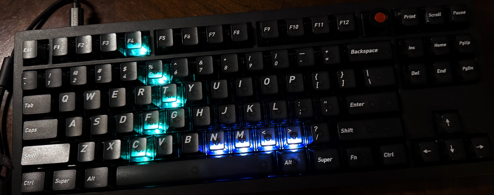

# Abralia

## Give your keyboard an Agent Mode—not a downgrade.

***Don't be afraid of flashing our firmware, your keyboard will still able
to loop through existing RGB modes, configure with VIA and Keychron Launcher,
and switch to 8K polling rate with our version of firmware,
and getting additional cool functions !***

Abralia is an open-source firmware and desktop software project that turns a
compatible per-key RGB keyboard into a physical interface for coding agents.

Abralia is compatibility-first and additive by design. Its native firmware
keeps Keychron RGB effects 0–24 and keeps VIA/Keychron Launcher, encoder, and
8K report-rate support enabled while adding independent per-key brightness,
effect 25, and an opt-in Host Interaction Mode.

It does not require permanently replacing ordinary keys with unused F13–F24
bindings. Unbound controls continue to behave normally, Host Interaction
bindings are volatile, and stale or disconnected host sessions are designed
to restore ordinary input behavior.

This repository is currently a pre-alpha implementation checkpoint.

> **Compatibility status:** Preserving normal keyboard behavior is a project
> requirement, not an optional feature. Both firmware variants build
> successfully and have been exercised on the reference keyboard. Maintainer
> testing confirmed all physical keys and Fn layers, normal encoder behavior,
> existing RGB modes and controls, VIA remapping, Keychron Launcher
> configuration, reconnect and sleep/wake behavior, DFU flashing, and normal
> recovery. Host Interaction testing also confirmed double-Pause entry and
> exit, CAPTURE/MIRROR routing, one-shot and session bindings, both encoder
> directions, and heartbeat recovery to normal input. On both variants,
> Launcher selected, persisted, and read back the 8K setting after reconnect.
> On the currently connected variant, direct Raw HID readback reports the 8K
> divider and the live keyboard enumerates as high-speed USB with a 125 μs
> interrupt interval. Only packet-level cadence for continuously changing
> reports remains independently unmeasured.

## Repository layout

- `abralia/firmware/` contains the QMK External Userspace firmware.
- `abralia/desktop/` is reserved for the desktop-side host implementation. Its
  language and runtime remain undecided.
- `experiments/` contains bounded hardware and protocol experiments.

## License

Abralia uses separate licenses for firmware and host-side software:

- Abralia firmware: GPL-3.0-or-later
- Desktop software, host tools, experiments, protocol material, and
  documentation: Apache-2.0

Upstream and third-party material retains its original notices and licenses.
See [LICENSE.md](LICENSE.md) for the exact scope.
