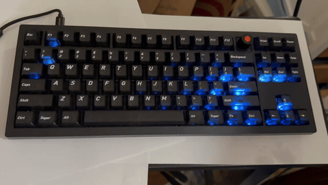
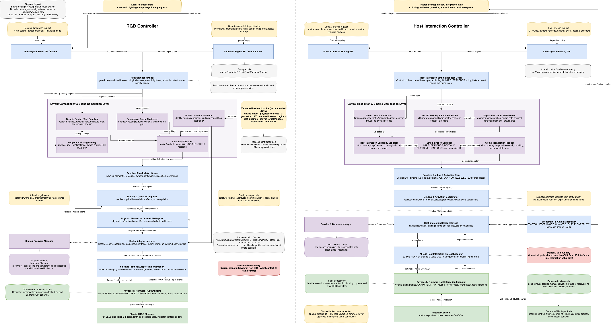

# Abralia

## Give Your Keyboard an Agent Mode - Without Tradeoff

***Don't be afraid of flashing our firmware, your keyboard will still able
to loop through existing RGB modes, configure with VIA and Keychron Launcher,
and switch to 8K polling rate with our version of firmware,
and getting additional cool functions !***

Abralia is an open-source firmware and desktop software project that turns a
compatible per-key RGB keyboard into a physical interface for coding agents.

Abralia is compatibility-first and additive by design. Its native firmware
keeps Keychron RGB effects 0–24 and keeps VIA/Keychron Launcher, encoder, and
8K report-rate support enabled while adding independent per-key brightness,
effect 25, and an opt-in Host Interaction Mode.

It does not require permanently replacing ordinary keys with unused F13–F24
bindings. Unbound controls continue to behave normally, Host Interaction
bindings are volatile, and stale or disconnected host sessions are designed
to restore ordinary input behavior.

This repository is currently a pre-alpha implementation checkpoint.

## Find the right documentation

For building or flashing firmware, using the desktop APIs, looking up default
key mappings, or reproducing an experiment, go to the
[documentation navigation page](docs/README.md).

> **Compatibility status:** Preserving normal keyboard behavior is a project
> requirement, not an optional feature. Both firmware variants build
> successfully and have been exercised on the reference keyboard. Maintainer
> testing confirmed all physical keys and Fn layers, normal encoder behavior,
> existing RGB modes and controls, VIA remapping, Keychron Launcher
> configuration, reconnect and sleep/wake behavior, DFU flashing, and normal
> recovery. Host Interaction testing also confirmed double-Pause entry and
> exit, CAPTURE/MIRROR routing, one-shot and session bindings, both encoder
> directions, and heartbeat recovery to normal input. On both variants,
> Launcher selected, persisted, and read back the 8K setting after reconnect.
> On the currently connected variant, direct Raw HID readback reports the 8K
> divider and the live keyboard enumerates as high-speed USB with a 125 μs
> interrupt interval. Only packet-level cadence for continuously changing
> reports remains independently unmeasured.

**Keyboard support and contributors.** Abralia currently implements and
validates only the Keychron V3 8K ANSI encoder. We welcome developers who want
to port the firmware and device profile to other keyboards. TKL is not an
Abralia requirement: compatibility work for compact keyboards and even split
layouts is equally welcome. Another TKL target is simply the most
straightforward first port because the current firmware assumptions, semantic
regions, device profile, and validation fixtures were built around the V3 8K.
The V3 family can reasonably be viewed as Keychron's value-oriented,
plastic-case counterpart to the premium aluminum Q3 TKL family: they share the
broad 80% layout and customization concept, but they are not electronically
identical. In the pinned QMK source, a promising next port is the Q3 Max ANSI
encoder in wired mode because it also has a 6×17 matrix shape, 87-key RGB
arrangement, encoder, Keychron RGB/VIA/Launcher path, and SNLED27351 SPI driver
family. The Q3 Max still uses STM32F401 with `stm32-dfu`, operates at 1K rather
than 8K, and adds wireless, battery, and transport logic, so it requires its
own build target, profile review, and hardware testing rather than a V3 8K
firmware binary.

What the Abralia firmware adds to a Keychron keyboard

*The fog orb is a host-driven effect-25 scene rendered through Abralia's
desktop RGB API, not a permanently stored keyboard effect.*

- **True independent per-key brightness.** Effect 25 renders each key's full
  HSV value, so individual keys can be bright, dim, or completely off while
  the global brightness remains a master ceiling.
- **Host-driven full-keyboard scenes and animation.** The desktop API can send
  complete 87-key frames for smooth gradients, status surfaces, progress,
  notifications, game layouts, and visual experiments such as the animation
  above.
- **Guarded frame updates with automatic recovery.** Complete frames are
  committed atomically and require a live host lease. If updates stop, the
  firmware leaves the stale frame and returns to its local awaiting state.
- **A firmware-native awaiting halo.** When effect 25 is not displaying a host
  scene, the keyboard can render a low-power breathing halo locally without
  continuous computer-side frame streaming.
- **Generic Host Interaction controls.** The
  `abralia_host_interaction` variant lets a trusted desktop broker temporarily
  bind matrix keys, knob press, and both encoder directions to opaque action
  IDs without hard-coding agent commands into firmware.
- **Per-control `CAPTURE` or `MIRROR` routing.** A temporary binding can either
  suppress the ordinary key action or emit a Host Interaction event while
  preserving normal behavior. Unbound controls remain ordinary keyboard
  controls.
- **Bounded volatile lifetimes.** Bindings support session, TTL, and one-shot
  lifetimes. Host-forced activation uses renewable bounded leases, and no Host
  Interaction command writes EEPROM.
- **Explicit entry and fail-safe exit.** Double Pause toggles Host Interaction
  Mode, while heartbeat loss or clean session release clears volatile input
  state and restores normal behavior.
- **Compatibility remains the baseline.** Keychron RGB effects 0–24, VIA,
  Keychron Launcher, encoder mappings, the original USB identity, DFU recovery,
  and the V3 8K report-rate feature remain available.

## Repository layout

- `abralia/firmware/` contains the QMK External Userspace firmware.
- `abralia/desktop/` contains the Python 3.11+ generalized RGB developer API
  and CLI, with a macOS-first Keychron effect-25 adapter.
- `experiments/` contains bounded hardware and protocol experiments.

<strong>RGB and Host Interaction controller architecture</strong>

Editable source: [RGB_control_design.drawio](./docs/RGB_control_design.drawio)

## License

Abralia uses separate licenses for firmware and host-side software:

- Abralia firmware: GPL-3.0-or-later
- Desktop software, host tools, experiments, protocol material, and
  documentation: Apache-2.0

Upstream and third-party material retains its original notices and licenses.
See [LICENSE.md](LICENSE.md) for the exact scope.
