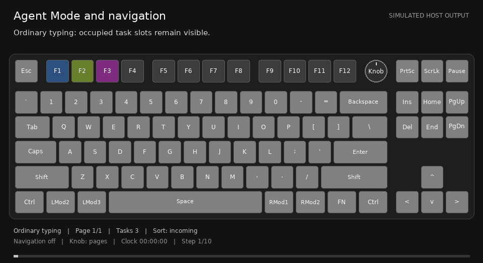
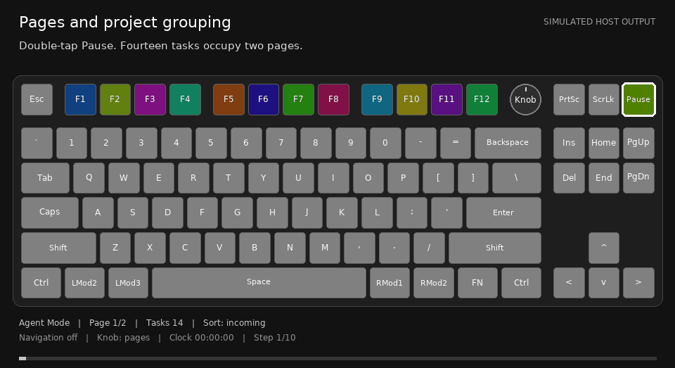
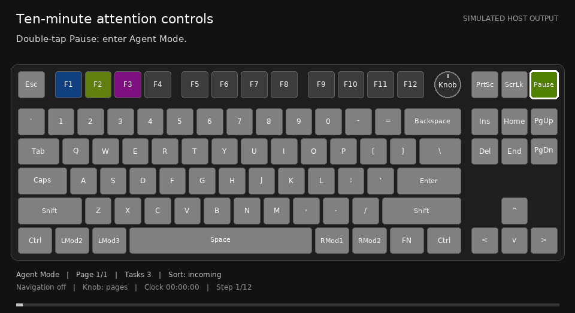
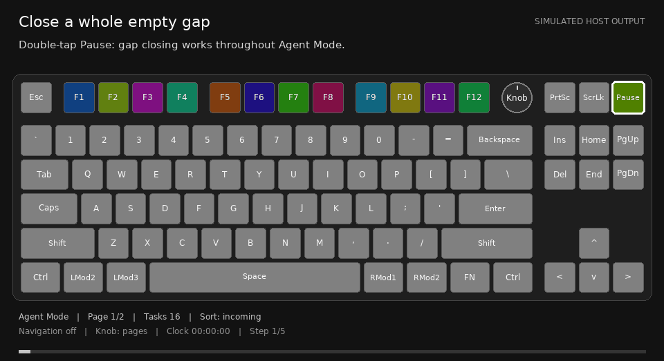

# Keyboard controls

[User guide](README.md) · [Lighting and effects](effects.md) · [Your keyboard](keyboards/README.md)

Names below identify **physical positions in the selected keyboard profile**.
For example, the pickup position is labeled `SCREENSHOT` in the profiles; its
ordinary action can be Screenshot or Print Screen. The mode position is not
always a Pause key. Use your model page to locate it.

## Enter and leave Agent Mode

| Action | Result |
| --- | --- |
| Double-tap the mode key | Toggle between ordinary input and active Agent Mode. |
| Hold the mode key for about **0.8 s**, while active | Arm keyboard navigation; repeat the hold to disarm it. |
| Stop or quit the owned Abralia backend | Release temporary bindings and restore the saved RGB scene. The keyboard's own brightness limit is preserved. |

Inactive mode keeps the white baseline and can still display task colors and
notifications. F-keys, navigation keys and an optional knob perform their normal
keyboard actions while inactive. Activate first to use pickup, mute or task
selection. The mode key retains its firmware gesture handling.

The mode key's yellow-green saturation breath is a mode/attention cue, separate
from the main-area notification animation. A single active mode-key tap is not
pickup or mute; use the dedicated call keys.

*Simulated host output.* Written sequence: double-tap the mode key → hold it →
navigation controls light → browse or select → hold again or wait 15 s without
navigation activity. Disarming clears the preview and returns the knob to page
browsing. Agent Mode and the selected task remain active.

## Pick up or mute an incoming call

These actions work in active Agent Mode without prior slot selection.

| Physical position | Cue | Action |
| --- | --- | --- |
| Screenshot / Print Screen | Pure green | Pick up the current call, select its task and switch to its page. |
| Scroll Lock position | Solid red | Mute that call's attention; leave the task available for later selection. |
| Occupied F1–F12 | Task color | Select that task directly. If it has a pending call, this also picks it up. |

The current caller stays the pickup target while later calls queue. F-key
selection remains available alongside pickup/mute, so you can choose a different
task. Merely browsing an unrelated task does not dismiss the current call.

Pickup, direct F-key pickup, or mute releases both bindings **for that handled
call**. Another waiting call may then claim them. A handled call does not rearm
its controls just because the task is selected again or its attention expires.
Muted tasks remain accessible through their F-keys. Call mute leaves a quiet
fog reminder; it is distinct from the timed task mute below.

## Browse pages and preview tasks

Hold the mode key while active to arm the navigation layer. The occupied
navigation keys have distinct colors; normal typing-area background stays intact.

| Key | Action while navigation is armed | Cue |
| --- | --- | --- |
| Page Up or Up | Previous page | Cyan |
| Page Down or Down | Next page | Cyan |
| Left / Right | Previous / next occupied task on this page; skip gaps | Orange |
| Home / End | First / last occupied task **across all pages** | Purple |
| Enter | Confirm the preview and select its task | Yellow-green |
| Escape | Switch arrival/project sorting | Violet |
| Insert / Delete | Timed attention controls, when available | Red to mute; yellow-green to restore |

Pages and task previews stop at their boundaries; they do not wrap. Moving the
preview does not open a task. An occupied F-key also selects directly.
Navigation stays armed after selection. Another mode-key hold, **15 s without
navigation activity**, or leaving Agent Mode disarms it. Timeout and hold-disarm
also clear the knob's preview/timer and restore page browsing. They do not end
the selected task or answer a pending question.

### Optional knob

| Knob action while active | Page browsing | Agent selection |
| --- | --- | --- |
| Rotate clockwise / counterclockwise | Next / previous 12-position page | Next / previous occupied slot on the current page |
| Press the knob | Switch to agent selection | Switch to page browsing |
| Press highlighted Enter | No preview to confirm | Select the previewed task |

Arming keyboard navigation starts the knob in agent selection. A knob press
can switch its function while navigation remains armed; the arrow/navigation
keys keep the actions in the table above. Knob-only agent selection returns to
page browsing after **60 s without selection activity**. If keyboard navigation
is also armed, its earlier 15 s idle timeout ends the combined selection mode.
Knob selection can be entered again while a task is focused.

Keyboard navigation provides the same browsing workflow on models without a knob.

### Number-row page indicators

Changing pages shows the populated pages on `1`–`9`, `0` for **5 s** after the
last page action. Other populated pages are dim cyan; the current page is orange.
In knob agent-selection mode this display stays visible, and a populated page's
digit jumps directly to that page. It does not select a task.

Digits return to ordinary input when agent selection ends. They are indicators
only during ordinary page browsing. With more than ten pages, they represent
the current ten-page bank: `1`–`0` for pages 1–10, then 11–20, and so on. An empty
page has no jump binding, even if its current-page indicator is shown.

## Sort tasks without changing their identity

While keyboard navigation is armed, tap violet Escape to alternate:

| Order | Placement | Task colors |
| --- | --- | --- |
| Arrival | Registration order; new tasks append after the current layout | Each task's cached individual color |
| Project | Projects in first-seen order, then registration order within each project | Related colors within each project's family |

Sorting closes layout gaps. A new task in project order inserts after its
project's tasks, shifting later positions forward and creating another page when
needed. The previewed task, or a visible selected task, remains the browsing
anchor when it moves across a page boundary. Stable slot identities, ownership,
selection, questions and mutes stay attached to the same tasks.

Switching back restores the cached individual colors. Colors are generated
procedurally beyond the initial families; there is no fixed palette-size limit
on registration. Physical RGB has finite colors, so very large populations may
look similar or repeat a color. Color is never the ownership identifier.

Order and both palettes are saved with recoverable allocations. A surviving
client must reconnect with its recovery proof to restore a slot after backend
restart. Unresolved startup reservations temporarily block sorting and grouped
insertion. Older saved data has no historical arrival record; its saved display
order supplies the initial arrival order.

*Simulated host output.* Written sequence: browse the interleaved task colors →
arm navigation → tap Escape to group projects → add a task → later tasks move
across pages if needed → tap Escape again to restore arrival order and individual
colors. An F-key's position can change while its task identity stays the same.

## Control attention for ten minutes

These bindings require keyboard navigation. Their target is, in order:
**the previewed task → the focused task → the current incoming caller**.

| Gesture | Result |
| --- | --- |
| Tap Delete | Mute the target task for **10 min**. Tap it again with that muted task targeted to restore it early. |
| Hold Delete for **1.2 s** | Restore all individual timed task mutes, when any exist and Delete is available. |
| Tap Insert | Keep only the target task eligible for automatic attention for **10 min**. |
| Tap Insert again | End that exclusive-attention mode early. |

A key is red when its next action mutes and yellow-green when its next action
restores. Delete loses its binding and cue during exclusive attention; Insert
remains the restore action. Entering exclusive attention clears individual
timed mutes. Leaving it, including expiry, makes all tasks eligible again under
that layer; it does not reinstate earlier individual mutes.

Muted slots become dimmer and less saturated, but remain selectable. Timed mute
hides their fog while it continues aging. These controls do not stop agent work
or answer requests. Persistent **project mute in the app** is a separate layer;
Delete/Insert restoration does not unmute a project that is disabled there.
Unavailable controls retain normal input and have no attention-policy highlight.

*Simulated host output.* Written sequence: preview a task → use red Delete to
mute it → the slot dims and Delete changes to a restore cue → restore it, or
use Insert to give only that task attention → Insert restores the full set.

## Hold an empty gap to close it

In active Agent Mode, hold **any empty F-key in a gap** for **1.2 s**. All empty
positions belonging to that visible gap brighten together, then flash once for
**0.12 s**. Later tasks pack forward in their existing order, including from
later pages. Positions before the chosen gap stay unchanged.

For example, if F2–F5 are empty, holding F3 selects the whole F2–F5 gap. It does
not fill only F3. No extra navigation or knob-selection mode is required, and
closing a gap does not open a task.

Releasing early, changing page/layout, leaving Agent Mode or interrupted input
cancels the hold. Empty positions after the last task have nothing to pull
forward. Short empty-slot taps do nothing in active mode; inactive F-keys remain
ordinary input. Startup recovery reservations must settle before compaction.

*Simulated host output.* Written sequence: hold any key in the empty block →
the entire gap brightens → one confirmation flash → later slots move forward.
Task identity and its cached colors remain attached to the moved task.

## Escape depends on the current mode

| Highest applicable state | Escape action | Cue |
| --- | --- | --- |
| A static keyboard guide is visible | Dismiss the guide | Red |
| Keyboard navigation is armed | Switch slot sorting | Violet |
| A task is focused, outside navigation | Leave focus; restore routine lighting and page browsing | Red, fading with the selected background |
| None of the above | Ordinary Escape | No Abralia action cue |

The guide takes priority over navigation and task focus. While it is visible,
Escape is the only host-captured key; its other highlighted keys remain ordinary
input. The physical mode gesture still works. Outside navigation, the optional
focus-exit binding remains usable after its red cue has faded. Exiting focus
keeps Agent Mode active and does not resolve a pending question.
Hosts can disable this focus-only Escape binding with `escape_exits_focus: false`;
guide dismissal and navigation sorting remain separate actions.

## Questions and native input

Abralia can notify you that an agent is waiting for an answer. Pick up or select
its F-key to navigate toward that task, then use the native application to answer.
Automatic question-panel focus, synthesized answers and approval execution are
not implemented as a supported workflow.

Automatically observed Codex questions do not guess answer keys. Legacy
agent-reported questions can request experimental number/Enter lighting, but
these are hints only: they do not bind a number to a native option. Number
selection has not worked in the inspected Codex desktop asynchronous card.
Click/focus the native question as needed and use its supported UI controls.

Navigation and knob selection temporarily capture Enter and, in agent selection,
page digits. Disarm them with a mode-key hold or return to inactive typing before
using those keys in another application. A picked-up question can remain pending
after these browsing modes or the selected-color background time out.

The default local question lifetime is **600 s**, independently of the shorter
notification lifetime. Answer, cancellation, a known native lifecycle ending, or
local expiry clears the associated question lighting/focus. Expiry is recorded
as cleanup, never as an answer or approval. A skipped question is not treated as
accepted. See [lighting lifetimes](effects.md#notification-and-question-lifetimes).

Documentation: [Apache-2.0](../../LICENSE.md).
