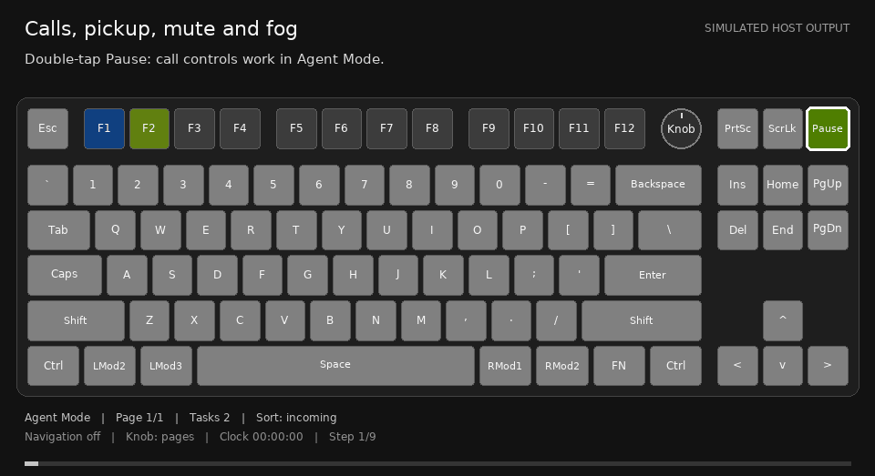
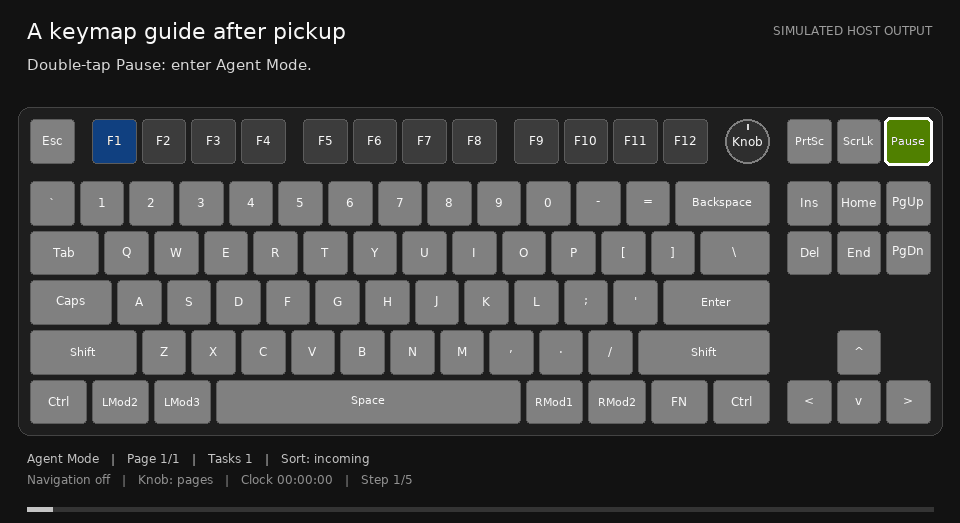

# Lighting and effects

[User guide](README.md) · [Controls](controls.md) · [Your keyboard](keyboards/README.md)

Task colors identify tasks. Action colors identify what a highlighted control
will do. Motion adds attention or preview emphasis; a steady red task slot alone
is not an error indicator. The values below are current host defaults, not
measurements of physical LED brightness.

## White baseline and brightness

The routine background is **static white**, requested at **50% frame value** by
default. It stays on during inactive typing. The host can request 0–100%; zero
blacks out the background while still allowing visible task, mode and notification
signals. The keyboard's own brightness adjustment remains the upper bound.
The backend does not overwrite that brightness register during playback or cleanup.
Setting the keyboard's own brightness to zero therefore turns off all LEDs;
setting only the host background to zero does not.

Effect 25 normalizes a frame against its brightest key before applying the
keyboard limit. Consequently, a requested 25% or 50% background is a relative
frame value, not a guaranteed absolute fraction of maximum hardware brightness.
A uniform dim-white frame can normalize upward. The backend fits routine slot
colors to the existing frame maximum so registering a task does not dim the
rest of the keyboard.

With any slots registered, **empty F-key positions use 50% of the routine
background value**. Only the F-row gets that extra reduction. Occupied positions
show task identities, and releasing the last slot restores the F-row baseline.
Selection adds a dim lavender tint to empty F-key positions; it does not turn
the main typing area black.

Inactive routine colors retain **75% saturation**: they look somewhat whiter,
rather than simply becoming darker. Notifications are exempt from this reduction.
The host setting and its configuration path are covered in the
[backend brightness reference](../../abralia/desktop/BACKEND.md#host-configuration-and-inspection).

## Color vocabulary

These are source colors before brightness scaling, mixing and display effects.
Use the key's context as well as its color to interpret the action.

| Cue | Default source color | Meaning |
| --- | --- | --- |
| Yellow-green | `#A0FF00` | Positive confirmation, preview Enter, mode cue, notification onset |
| Pure green | `#00FF00` | Pick up the current call |
| Red | `#FF0000` | Mute, leave task focus, or dismiss a guide; the next action determines which |
| Cyan | `#00BFFF` | Page movement; dimmed for other populated page digits |
| Orange | `#FF9000` | Move between individual slots; current-page digit |
| Purple | `#A060FF` | Home/End boundary navigation |
| Violet | `#A040FF` | Escape changes slot sorting while navigation is armed |
| Dim lavender tint | Derived from `#DDD2FF` | Empty F-row positions during selection preview |
| Individual/task-family color | Generated and cached | Task identity in arrival/project sorting |

Delete and Insert show red for a mute action and yellow-green for a restore
action. The strong call controls keep their separate meanings: green pickup and
solid red call mute.

## Steady status, mode cue and preview

Routine occupied slots remain steady across status updates. The agent can
report idle, progress, error, action requested or completion, but these semantic
states do not replace its identity hue with a universal status color.

For registered Codex tasks, a newly observed finished turn also triggers the
normal notification sequence. It means the response is ready to read; it does
not declare the whole project complete. Repeated observations and old turns
found at startup do not ring again. Task and project mutes still apply.

A newly notifying task's visible F-key also gives **three brightness breaths
over six seconds**, keeping its task color. The cue starts when the notification
arrives, including while its main-area animation is queued, then returns to
steady lighting. Pickup, mute and withdrawal stop it; paging and retries do not
restart it. The current selection preview and a picked-up keyboard guide retain
their existing visual priority.

The physical mode key has a separate cue:

| State | Mode-key appearance |
| --- | --- |
| Inactive, no available attention | Routine background |
| Inactive, attention is available | Breath between whiter and yellow-green |
| Active Agent Mode | The same saturation breath remains available as the mode cue |

This breath varies **HSV saturation (S)** at a fixed brightness value (V).
The main background and idle slots do not breathe with it. The Scroll Lock
call-mute key stays solid red.

The previewed F-key blends strongly toward yellow-green while retaining some
task color, then slightly reduces saturation. The host targets at least roughly
30% brightness separation from other occupied slots. When there is insufficient
headroom, it temporarily dims the other slots rather than raising the frame's
global maximum. In knob agent-selection mode the preview also breathes in
**brightness (V)** over a 2 s cycle, from 85% to 100% of its highlighted level.
The comparison slots stay steady. Leaving preview restores routine appearance.

Timed task mute, exclusive attention's muted tasks, and persistent project mute
reduce the affected slots to **50% brightness and 50% saturation** by default.
Call mute alone is a different action: it quiets that call and does not apply
the timed task-mute appearance.

Arrival sorting uses each task's individual color. Project sorting uses related
colors within a project family, with variation in hue, saturation and value.
Both colors are cached, so toggling order does not generate a fresh random hue.
The palette extends procedurally; finite RGB space cannot make an unlimited
number of tasks perceptually distinct. [Sorting controls](controls.md#sort-tasks-without-changing-their-identity)
explain placement and recovery.

## Selected-task background

Selecting an occupied F-key, confirming a preview, or picking up a call colors
the main typing area with that task's identity. It stays static for **15 s**,
then smoothly fades to the current background over **5 s**. The red focus-exit
Escape cue fades with it. Selecting again restarts that timer.

This is a lighting return. Agent Mode, the selected task and an unanswered
question can outlive it. Outside navigation, Escape still leaves focus even
after its cue has faded. Pressing Escape restores routine lighting immediately;
inside navigation, violet Escape instead changes sorting.

Other attention can affect which scene is displayed. A new incoming call can
interrupt an old browsing hold; a picked-up pending question keeps its attention
priority while later foreground animations wait. The background timer does not
answer or cancel that question.

## Incoming notification to fog reminder

*Simulated host output, not physical footage.* Long waits may jump between
labeled simulation times. The complete written sequence and real default
intervals are below; GIF playback length is not a timing specification.

| Stage | Default interval | What appears |
| --- | --- | --- |
| Onset | **0.58 s** total | Brief preparation, yellow-green expansion, region fill and emphasis |
| Task-color transition and breath | **8 s** | The main area transitions from yellow-green toward the task's color; the transition occupies the first 4 s of this breathing phase |
| Condensation | **2 s** | The unhandled notification contracts into a drifting fog orb |
| Orb reminder | **120 s** | The task-colored orb moves through the typing area and available navigation/arrow area |
| Aging fade | **60 s** | The orb gradually blends into the background |
| Explicit acknowledgement/removal | **0.5 s** fade for an already formed orb | The task's existing reminder disappears after pickup, direct selection or a known terminal lifecycle change |

An onset picked up before an orb forms simply stops; the host does not invent a
new orb merely to fade it out. Each task has one aggregate orb. Genuine new
notices can refresh that task's reminder; retries and repeated status reports do
not create extra bodies or restart the same onset.

Several tasks can leave orbs at once. Their soft envelopes overlap; smaller
collision cores deflect their paths. Overlapping contributions mix in linear
RGB, so the visible overlap can differ from either task's original color.
The host keeps the combined output within the existing frame brightness limit.
Slot, mode, navigation, question and call controls take precedence where they
occupy a key. Orbs never capture keys or navigate to a task by themselves.

Pick Up or direct F-key selection acknowledges the currently existing visual
notices for that task. A later new request can notify again. **Call mute** parks
a quiet orb; **timed task or project mute** hides affected orbs while they keep
aging. Removing a slot, cancellation and known native resolution remove the
associated visual state. Orbs do not survive backend restart.

Opening a task manually in another application is not automatically detected
as a view by this visual lifecycle. A navigation request is also not proof that
the native destination was visibly focused. Timed aging provides cleanup when
that external view is unknown; it does not mark the task viewed or completed.

## Notification and question lifetimes

The notification's default attention lifetime is **300 s** from creation. It is
also an upper bound on that notice's fog, so delayed presentations can have
less than the full 120 s hold plus 60 s fade. A question has a separate default
local lifetime of **600 s**.

| Event | What ends | What does not happen |
| --- | --- | --- |
| 15 s navigation inactivity | Navigation, preview and knob selection bindings | Agent Mode and the selected task do not end |
| 15 s selected-background hold + 5 s fade | Static task-color background and its red Escape cue | The question is not answered; focus can remain |
| Orb aging or notification expiry | That visual/attention presentation | The task is not marked viewed or completed |
| Answer, cancellation, known native lifecycle end, or 600 s local question expiry | Associated local question hints/focus | A timeout is not submitted as an answer or approval |

An unhandled question may remain quietly pickup-able after its notification
expires. Mute is no longer offered for an expired attention presentation.
A previously handled call does not regain pickup/mute controls through expiry.
Native-question automation and experimental shortcut hints are explained in
[Questions and native input](controls.md#questions-and-native-input).

## Static keyboard guides

An agent can request a static map of relevant keys. The guide waits for pickup;
it does not immediately replace the keyboard. Pick up the call, or select its
task's F-key, to reveal it. It remains accessible after call mute or attention
expiry while the guide itself is pending.

*Simulated host output.* Written sequence: guide request arrives → Pick Up
reveals the map → use the highlighted keys normally → red Escape dismisses it.

While visible, the guide disarms browsing navigation and takes over the host
scene. **Only Escape is captured**; other highlighted keys retain their normal
input. The mode key keeps its mode cue/gesture. Entering inactive mode hides the
guide; re-entering Agent Mode can show it again until it is dismissed or cleared.
The guide is static apart from the independent mode cue, and has no automatic
display timeout. Dismissal, agent withdrawal/replacement or slot release ends it.
It neither executes highlighted commands nor answers native questions.

## Optional custom notification clips

An agent may supply a bounded ring, spot, sweep or pulse clip for part of its
notification. The ordinary breathing effect is the fallback when no suitable
clip is supplied. With default timing, the identity transition takes 4 s and up
to 4 s remains for the custom clip before normal fog formation. Controls remain
visible above it; pickup/mute interrupts the presentation.

These are constrained host-rendered effects, not executable agent scripts or
raw hardware control. Hosts can disable them. See the
[custom animation reference](../../abralia/desktop/BACKEND.md#optional-custom-notification-animation)
and [keyboard simulator](../../tools/keyboard-simulator/README.md) for examples.

Default values come from the
[broker configuration](../../abralia/desktop/src/abralia/backend/core.py),
[renderer](../../abralia/desktop/src/abralia/backend/render.py) and
[notification lifecycle](../../abralia/desktop/src/abralia/backend/notification_visuals.py).
Documentation: [Apache-2.0](../../LICENSE.md).
