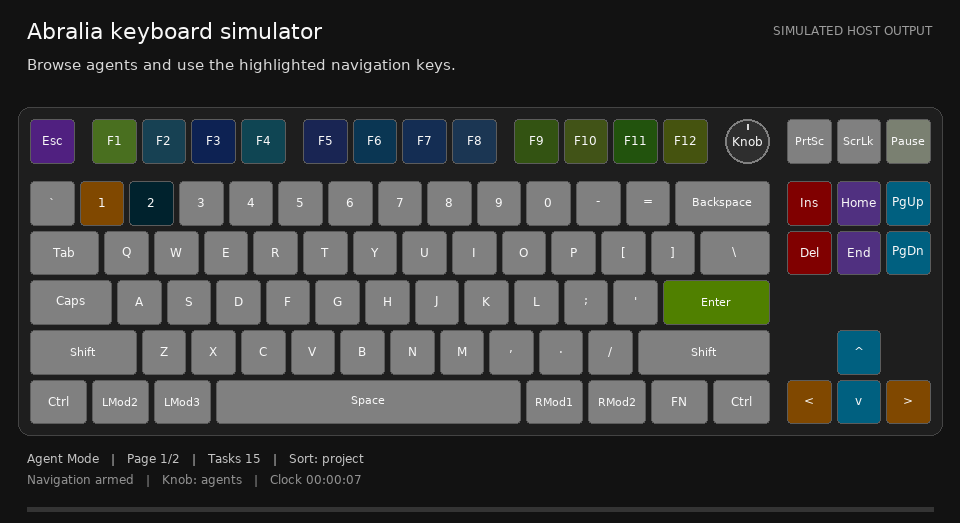

# Abralia keyboard simulator

A standalone, local design tool for trying keyboard interactions and LED effects
without connecting to a keyboard. It uses Abralia's production host controller,
physical-key routes and LED renderer. The interface, key borders and annotations
are grayscale; only the simulated LEDs use color.

<p align="center"></p>

This folder contains its own browser UI, server, virtual-time engine, examples,
tests and GIF exporter. It can run alongside the normal Abralia app. Built-in
simulation never connects to the live broker, reads agent conversations, opens
HID, changes firmware, or opens an agent application's window.

## Start the tool

Use Python 3.11+ and a browser. From the repository root:

```sh
python3 -m venv .venv
.venv/bin/python -m pip install -e abralia/desktop pillow
.venv/bin/python tools/keyboard-simulator/simulator.py serve
```

Open the `http://127.0.0.1:<port>` address printed by the command. The server binds
only to the local computer; Ctrl-C stops it. No Codex plugin, firmware flash or
physical keyboard is required. Pillow is needed for PNG/GIF export; the browser
simulator itself does not require an imaging library.

For a ready-made interaction example:

```sh
.venv/bin/python tools/keyboard-simulator/simulator.py serve \
  --scenario mode-navigation
```

On Windows, use `.venv\Scripts\python.exe` in place of `.venv/bin/python`.
The simulator is independent of the macOS-only packaged control panel.

## Use the workbench

1. **Choose a keyboard.** Its geometry and physical controls come from the device
   profile. Models without a knob show keyboard navigation instead.
2. **Load a scenario or add test agents.** The inspector can change a simulated
   agent's state, send/withdraw a call, or release its slot.
3. **Use the drawn keyboard.** Click a key for a tap, double-click the physical
   mode key for Agent Mode, or hold it for keyboard navigation. Hold an empty
   F-key to see the gap-closing progress and flash. The controls below the board
   rotate or press the optional knob. Browser focus stays in the simulator.
4. **Play, pause, step or change speed.** The clock is virtual. Gestures can be
   exercised while paused; a held-key release can advance the virtual hold
   duration. Scripted timelines replay their own inputs, so use Replay before
   checking the same sequence again.
5. **Inspect the result.** Hover/focus a key for its RGB value and current action.
   Events show controller transitions. A window-opening request is recorded as
   simulated; it never opens a real task.

The white-background slider changes the host scene's background percentage.
It is not a physical keyboard-brightness measurement. A custom frame/plugin can
override the scene's colors. Real keycaps, LED diffusion, firmware brightness
limits, USB timing and input capture still need physical verification.

The [user guide](../../docs/user-guide/README.md) explains the complete
[controls](../../docs/user-guide/controls.md) and
[effects](../../docs/user-guide/effects.md), with the GIFs generated by this tool.

## Plug in a JSON design

Open **Design JSON**, import or edit a file, then choose **Apply design**. This
starts a new simulation from that design. **Download JSON** saves the editor's
contents. JSON is data-only: HTTP cannot load Python modules or arbitrary files.
The supplied examples are:

| Example | Purpose |
| --- | --- |
| [timeline.json](examples/timeline.json) | Two agents, incoming calls, pickup and mute |
| [notification-clip.json](examples/notification-clip.json) | A custom notification animation through the production contract |
| [frame-map.json](examples/frame-map.json) | Direct per-key LED colors and background |

A minimal design looks like this:

```json
{
  "version": 1,
  "name": "My first call",
  "seed_agents": [{"id": "review", "project": "Demo", "label": "Review"}],
  "timeline": [
    {"at": 0, "action": {"type": "input", "key": "MODE", "gesture": "double"}},
    {"at": 1, "action": {"type": "notify", "agent_id": "review"}}
  ],
  "frames": []
}
```

`at` is virtual time in seconds. Use stable test-agent IDs, not F-key positions,
to address agents. `MODE` resolves to the selected profile's mode position;
`KNOB_CW` and `KNOB_CCW` address its optional encoder. Other inputs use physical
profile element IDs such as `F1`, `ESC`, `SCREENSHOT` and `SCROLL_LOCK`.

For a scripted hold, use separate `press` and `release_key` events. The intervening
virtual frames show hold progress:

```json
[
  {"at": 2, "action": {"type": "press", "key": "MODE"}},
  {"at": 3, "action": {"type": "release_key", "key": "MODE"}}
]
```

Actions include `input`, `press`, `release_key`, `add_agent`, `notify`, `release`,
`set_state`, `guide`, `notification_animation` and `background`. The
[timeline examples](examples/) show their field names. `notify` accepts
`enabled: false` to withdraw a call. A timeline cannot change its own playback
clock or load another design. Unknown actions, invalid fields and unknown keys
are rejected.

`frames` is an optional sequence of `{at, colors, background?}` records.
Colors are six-digit RGB strings. The latest frame holds until the next frame;
there is no implicit interpolation. Use a Python callback for continuous
algorithms. Scene frames are simulator-only overlays, not new agent permissions.
Imports are bounded to 1 MB, 2,000 events and 1,000 frames.

You can also load a design when starting the server:

```sh
.venv/bin/python tools/keyboard-simulator/simulator.py serve \
  --design tools/keyboard-simulator/examples/timeline.json
```

## Plug in a Python effect

[frame_plugin.py](examples/frame_plugin.py) is a small continuous effect. A
plugin defines `frame(elapsed, profile, state)` and returns a dictionary containing
`colors` and/or `background`. `state` includes the key geometry, current LED
values, agents, bindings and clock.

```python
def frame(elapsed, profile, state):
    return {"colors": {"W": "2080FF", "A": "2080FF", "S": "2080FF", "D": "2080FF"}}
```

```sh
.venv/bin/python tools/keyboard-simulator/simulator.py serve \
  --plugin tools/keyboard-simulator/examples/frame_plugin.py
```

Python plugins are trusted local code, executed only when explicitly supplied on
the command line. They have the Python process's permissions; they are not
sandboxed. The browser importer accepts JSON only. A plugin may be combined with
a JSON design to inspect its effect over simulated agent state.

Python users can also import `Simulator` from `abralia_simulator.engine` when this
folder is on their module path. Its `advance(seconds)`, `input(...)`, `action(...)`,
`load_design(...)`, and `snapshot()` methods expose the same deterministic engine
used by the browser and exporter.

## Export your design or the usage GIFs

Export a custom JSON design, a Python effect, or both:

```sh
.venv/bin/python tools/keyboard-simulator/simulator.py export \
  --design tools/keyboard-simulator/examples/frame-map.json \
  --plugin tools/keyboard-simulator/examples/frame_plugin.py \
  --duration 6 --fps 12 --output /path/to/my-design.gif
```

Export one narrated guide:

```sh
.venv/bin/python tools/keyboard-simulator/simulator.py export \
  --scenario paging-sorting --output /path/to/paging-sorting.gif
```

Regenerate all six guide GIFs from the repository root:

```sh
.venv/bin/python tools/keyboard-simulator/simulator.py export \
  --all --output docs/assets/usage --fps 12 --width 960 --jobs 6
```

The scenarios cover mode/navigation, notifications, paging/sorting, attention
policies, gap closing and keyboard guides. GIFs use one shared palette per clip,
preserve grayscale annotations and mark accelerated long waits explicitly.
They illustrate simulated host output, not a physical recording or timing test.
Export is limited to 1,200 frames and widths of 640–1,600 pixels.

## Use another keyboard

Select one of the three bundled profiles, or pass an explicit JSON profile:

```sh
.venv/bin/python tools/keyboard-simulator/simulator.py serve \
  --profile /path/to/my-keyboard-profile.json \
  --design tools/keyboard-simulator/examples/frame-map.json
```

Follow the [profile format](../../abralia/desktop/src/abralia/resources/profiles/README.md)
and use that profile's actual RGB key IDs in your design. Geometry controls the
drawn positions and widths; encoder metadata controls whether the knob appears.
Profiles without the required host-interaction controls support LED frame/plugin
preview only. They do not silently inherit the V3's key bindings.

The [keyboard guide index](../../docs/user-guide/keyboards/README.md) explains how
to add a model page without duplicating shared control/effect documentation.
Simulator support does not establish compatibility of a physical keyboard or
the `led_only_not_interactable` firmware with agent input. Physical Agent Mode
requires the matching `abralia_host_interaction` firmware.

## Test

From the repository root:

```sh
.venv/bin/python -m unittest discover -s tools/keyboard-simulator/tests -p 'test_*.py' -v
```

Tests exercise production routing, virtual holds, multiple profiles, design
validation, HTTP isolation, deterministic frames and grayscale GIF export.
They open only isolated local simulator sockets, never a keyboard.

Source and documentation: [Apache-2.0](../../LICENSE.md). The optional image
exporter uses [Pillow](https://pillow.readthedocs.io/). The committed GIFs were
generated with Pillow 12.3.0 (MIT-CMU license); no Pillow source is vendored here.
